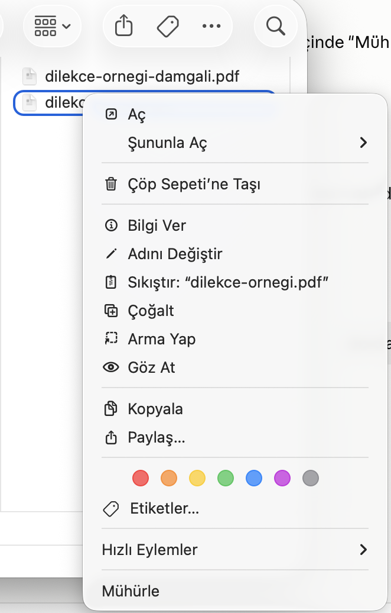
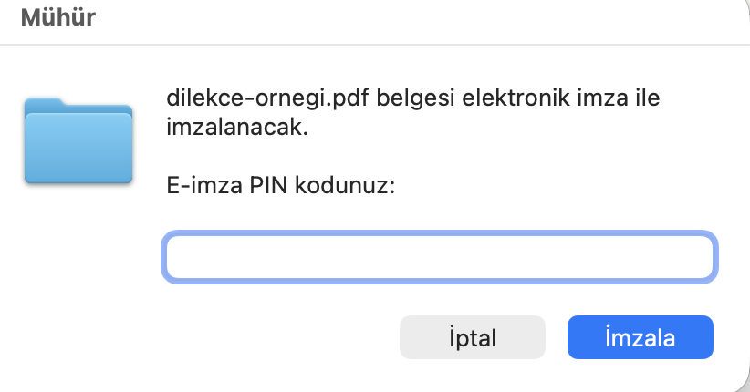
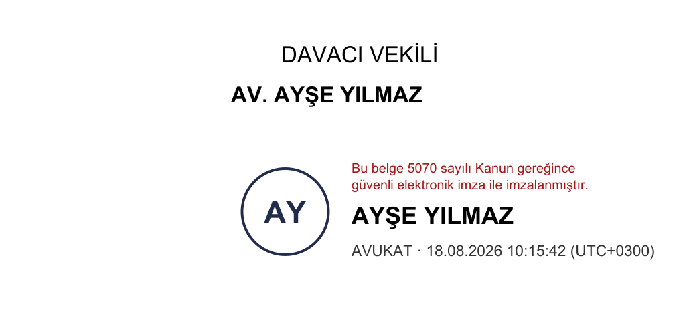
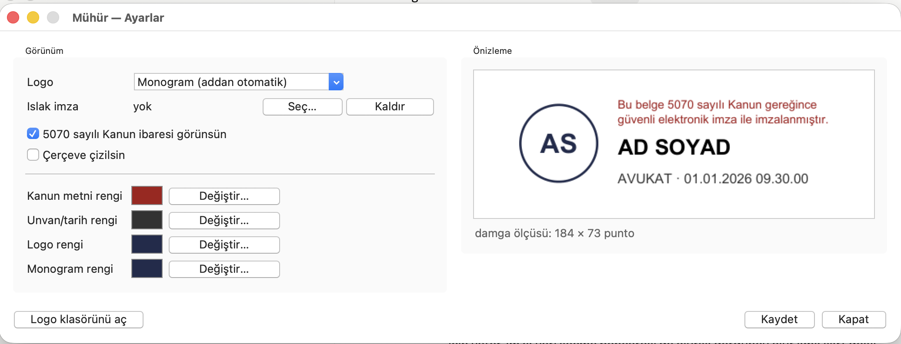

# Mühür

PDF belgelerini **nitelikli elektronik imza** ile imzalayan macOS aracı.

Finder'da belgeye sağ tıklayıp **Mühürle** demeniz yeterli: PIN sorulur, imza
atılır, damga sayfanın uygun yerine yerleşir.

Türkiye'deki avukatlar ve e-imza kullanan herkes için yazıldı. Yalnızca macOS.




**İki tık:** belgeye sağ tıkla, **Mühürle**'yi seç. PIN'i gir, biter. Ayrı bir
program açmana, belgeyi bir yere sürüklemene gerek yok — her şey Finder'da.

---

## Neden

macOS'ta e-imzayla PDF imzalamak son sürüm Adobe Acrobat'ta çalışmıyor: 26.001
sürümünde PKCS#11 modül yönetimi hem Apple Silicon hem Intel derlemesinde kapalı.
Preview'ın imza özelliği ise yalnızca görsel bir damga; nitelikli elektronik imza
değil ve hukuki geçerliliği yok.

Mühür bu boşluğu dolduruyor. Kartınızla doğrudan konuşuyor, standart **PAdES**
imzası üretiyor; sonuç Adobe dahil her doğrulayıcıda geçerli görünüyor.

## Kurulum

Terminal'i açın ve indirdiğiniz dosyayı çalıştırın:

```bash
chmod +x ~/Downloads/muhur-kur.sh && ~/Downloads/muhur-kur.sh
```

Kurulum Homebrew ve Python'u (yoksa) kurar, gerekli kütüphaneleri indirir,
Finder'a sağ tık seçeneğini ekler, uygulamayı oluşturur ve sonunda kartınızı
okuyup doğrular.

Her şey `~/e-imza` klasöründe kalır; sisteminizin başka hiçbir yerine
dokunulmaz.

**Ön koşul:** Kart sürücünüz (AKİS, SafeNet vb.) kurulu olmalı. Mühür sürücüyü
kendisi kuramaz — sağlayıcınızın (TÜRKTRUST, E-Güven, Kamu SM, E-Tuğra) macOS
sürücüsünü önce kurun.

## Kullanım

**Sağ tık → Mühürle** — arayüzsüz. PIN sorulur, damga uygun yere yerleşir.
Belgeyi okumayı Preview'da yaparsınız.

**Sağ tık → Birlikte Aç → Mühür** — belgeyi gösterir, imzanın geleceği yere
dikdörtgen çizersiniz.

**Mühür.app'e çift tık** — ayarlar penceresi. Damga görünümünü canlı
önizlemeyle düzenlersiniz: logo, renkler, ıslak imza, kanun ibaresi.

Sonuç `dilekçe.pdf` → `dilekçe_imzalı.pdf`. İmzasız asıl dosya yalnızca imza
başarıyla atıldıysa silinir; işlem yarıda kalırsa belgenize hiçbir şey olmaz.

### Damga

Damga ad ve unvanı **sertifikanızdan** okur, tarihi saat dilimiyle yazar.
Belgede adınızın altına, EKLER bölümünden önce yerleşir:



<sub>Görsel yalnızca damganın görünümünü anlatır; örnek belgedir, gerçek imza
içermez.</sub>

Yerleşim sırası: yeniden imzalıyorsanız önceki damganın yeri → belgede adınızın
altı (EKLER bölümünden önce) → sayfadaki boş alan.

### Görünümü kendinize göre ayarlama

`Mühür.app`'e çift tıklayın. Logo, renkler, ıslak imza ve kanun ibaresi
buradan ayarlanır; değişiklik anında önizlemede görünür.



Logo olarak addan üretilen monogramı, pakette gelen simgelerden birini ya da
kendi PNG'nizi kullanabilirsiniz. Simgeler tek renkli vektördür; istediğiniz
renge boyanır.

### Aynı belgeyi tekrar imzalamak

Kendi imzanız varsa "yeniden imzala" (öncekini kaldırır) ya da "ikinci imza
ekle" diye sorar. **Başkasının imzası varsa** geri alma seçeneği sunulmaz;
onun imzası korunur, sizinki ikinci imza olarak eklenir.

## Bilinmesi gerekenler

**İmzalama son adım olmalıdır.** İmzalı bir PDF'i düzenlerseniz imza geçersiz
olur. Düzenlenebilir aslınız Word dosyanız olsun.

**İmzalı PDF'i Preview'da açıp kaydetmeyin.** Preview dosyayı baştan yazdığı
için imza tamamen kaybolur ve sizi uyarmaz. Okumak sorun değildir.

**Kart aynı anda tek uygulamaya açılır.** İmzalarken AKİA, UYAP, Adobe gibi
başka bir e-imza uygulaması açıksa kartı meşgul eder.

**PIN'inizi dikkatli girin.** Kartta sınırlı deneme hakkı vardır.

## Doğrulama

```bash
~/e-imza/venv/bin/pyhanko sign validate --pretty-print dilekçe_imzalı.pdf
```

`The signature is cryptographically sound` ve `The signature covers the entire
file` satırlarını görmelisiniz. Çıktıda `untrusted` yazması normaldir — bu araç
kök sertifika deposu taşımaz; kurumsal geçerliliği Adobe Acrobat'ta açarak
görebilirsiniz.

## Farklı bir kart mı kullanıyorsunuz?

Mühür, TÜRKTRUST/AKİS kartlarında geliştirildi ve o kartın PKCS#11
uygulamasındaki dört tuhaflığı telafi ediyor. Farklı bir sağlayıcının kartında
çalışmazsa şunu çalıştırıp çıkan raporu paylaşın:

```bash
~/e-imza/venv/bin/python ~/e-imza/kart-raporu.py
```

Rapor PIN sormaz, imza atmaz, karta yazmaz — yalnızca kartın kendini nasıl
tanıttığını okur ve kişisel alanları maskeler.

## Kaldırma

```bash
rm -rf ~/e-imza ~/Applications/Mühür.app "$HOME/Library/Services/Mühürle.workflow"
```

## Teknik

- **pyHanko** ile PAdES imzalama, **python-pkcs11** ile kart erişimi
- Damga **PyMuPDF** ile vektör olarak çizilip imza görünümü olarak gömülür
- Kart, sertifika ve sürücü çalışma anında bulunur — hiçbir şey elle tanımlanmaz
- PIN yalnızca sürecin belleğinde kalır; komut satırına, kabuk değişkenine ya da
  diske hiçbir zaman yazılmaz

### AKİS kartına özgü telafiler

1. Nesneler etiketle değil **ID** ile eşleştirilir (Türkçe karakterli
   etiketlerde Unicode normalizasyon farkı eşleşmeyi bozuyor)
2. pyHanko'nun varsayılan `CKA_SIGN` filtresi kaldırılır
3. Kart özel anahtar için `SIGN=False` bildirdiğinden imzalama yeteneği elle
   eklenir
4. Kart birleşik `SHA256_RSA_PKCS` mekanizmasını tanımadığından ham `RSA_PKCS`
   moduna geçilir

## Lisans

MIT — ayrıntı için [LICENSE](LICENSE).

Simgeler [Phosphor Icons](https://phosphoricons.com) (MIT) — bkz.
[logolar/PHOSPHOR-LISANS.txt](logolar/PHOSPHOR-LISANS.txt).
